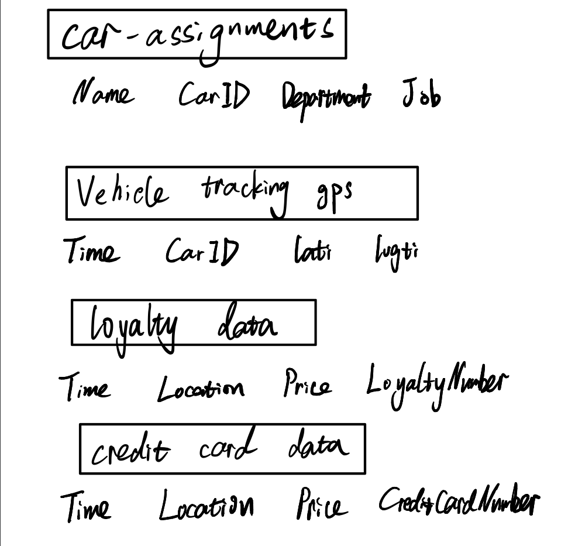

# Title:

plans on mini challenges to do  

## Motivation and Objective 


## Tasks and analysis  
### Mini challenge 1 - XZ  
what is the approach, tasks to perform, any challenge to expect, what are the expected outputs, story to tell  

### Mini challenge 2     

#### **BACKGROUND**:

Many of the Abila, Kronos-based employees of GAStech have company cars which are approved for both personal and business use. Those who do not have company cars have the ability to check out company trucks for business use, but these trucks cannot be used for personal business.

Employees with company cars are happy to have these vehicles, because the company cars are generally much higher quality than the cars they would be able to afford otherwise. However, GAStech does not trust their employees. Without the employees? knowledge, GAStech has installed geospatial tracking software in the company vehicles. The vehicles are tracked periodically as long as they are moving.


This vehicle tracking data has been made available to law enforcement to support their investigation. Unfortunately, data is not available for the day the GAStech employees went missing. Data is only available for the two weeks prior to the disappearance.

To promote local businesses, Kronos based companies provide a Kronos Kares benefit card to GASTech employees giving them discounts and rewards in exchange for collecting information about their credit card purchases and preferences as recorded on loyalty cards. This data has been made available to investigators in the hopes that it can help resolve the situation. However, Kronos Kares does not collect personal information beyond purchases.


#### **DATA SOURCE**:

[Download From Official Site](https://vast-challenge.github.io/2021/MC2.html)

Table Header | Second Header
------------- | -------------
car-assignments.csv | Employee Last Name, Employee First Name, Car ID, Employment Type, Employment Title
gps.csv | Timestamp, Car ID, Latitude, Longitude
loyalty_data.csv | Timestamp, Location, Price, Loyalty Number
cc_data.csv | Timestamp, Location, Price, Last 4 digits of the credit or debit card number
Geo Data | ESRI shapefiles of Abila and Kronos

{width=45%} 

#### **TOOLS WILL BE USED**:

This sub-project will fully conduct under R language. This task will be realized by coding with algorithm and some official packages to achieve the final goal. 
Following are some packages for example:

**sp**:Classes and methods for spatial data.

**sf**:A package that provides simple features access for R.

**spdep**:A collection of functions to create spatial weights matrix
objects from polygon 'contiguities', from point patterns by distance and
tessellations.

**maptools**:Set of tools for manipulating geographic data.

**raster**:Reading, writing, manipulating, analyzing and modeling of spatial data.

**tidyverse**:The tidyverse is an opinionated collection of R packages designed for data science.

#### **EXPECTED OUTPUTS**:

* Basic task

  * Using just the credit and loyalty card data, identify the most popular locations, and when they are popular. Try to find the anomalies and give recommends to correct these anomalies.

  * Infer the owners of each credit card and loyalty card.
  
* Advanced task

  * Add the vehicle data to analysis of the credit and loyalty card data. Find the anomalies in question 1 based on the new data. Find discrepancies between vehicle, credit, and loyalty card data.
  
  * Based on the data sources provided, identify potential informal or unofficial relationships among GASTech personnel.

  * Find evidence of suspicious activity and identify 1- 10 locations where might be occurring suspicious activity.

### Mini challange 3 - maybe  
what is the approach, tasks to perform, any challenge to expect, what are the expected outputs, story to tell  


## Conclusion  


```{r setup, include=FALSE}
knitr::opts_chunk$set(echo = FALSE)
```


