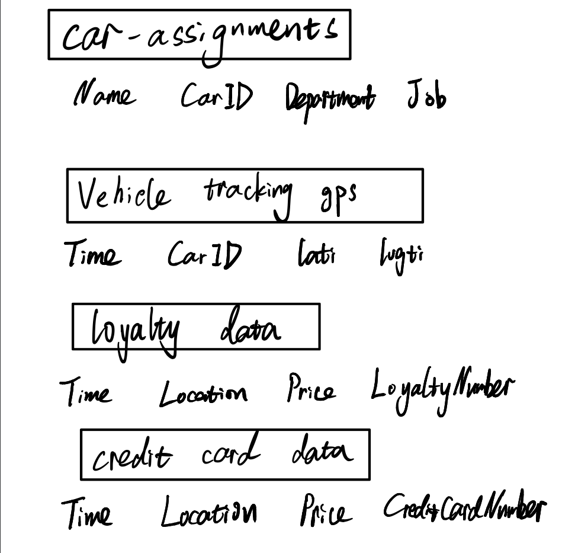
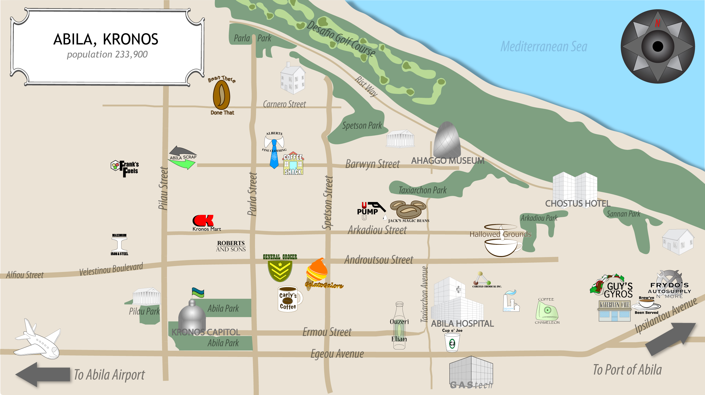

# Understanding the story behind missing GASTech employee  
The project will use data from [VAST challenge 2021](https://vast-challenge.github.io/2021/index.html) which the scenario, people, places, technologies are fictitious.The data used in the project, such as news article, resume, micro-blog posts are fictitious too.   

## Backgroud, Motivation and Objective   
There are two fictitious countries involved in the project setting, Kronos and Tethys. They are both located around Mediterranean Sea. Tethys is a modern country, an economic leader and a key member of Europe's economic, political, and defense organizations. On the contrary, Kronos is a country struggling with poverty with 70% of the population below poverty line. GASTech is a Tethys owned company operating natural gas production in Kronos. Employees are from both Tethys and Kronos with diverse background.     

In 2014, in the midst of celebrating GASTech IPO, several employees went missing. A political activist organization, Protectors Of Kronos(POK) was suspected to be in the disappearance.   

As data analysts specialized in visual analytics, we are helping law enforcement to dive into details and piece together the story of disappearance.  

1. Looking through resumes, past news articles, email conversation headers within GASTech to find out the relationship among the people and organizations. Organizations include GASTech, POK, the APA. The sub-task aims to provide background information of the kidnap and hint of suspicious people for further investigation.    
2. With GPS tracking data of GASTech cars provided to the employee, credit card transactions, and loyalty card usage, this sub-task aims to identify any suspicious itinerary and behaviors.  
3. Given collection of microblogs and emergency calls from the days surrounding the disappearance, we will use text analytics to evaluate the changing level of risk over time.   

## Tasks and analysis   
During the first state, the sub tasks will be distributed among the group members. Each member will take on 1 task. In the second stage, all analysis and visualization will be combined to create a final dashboard using R Shiny.    

### Mini challenge 1 - Xiaozhu  

#### task and approach
There are 3 categories of data provided for the mini challenge, email conversation headers, employee resume, current and past news article.   

* Extract sender and receiver in email headers and construct a graph  
* Analyze bias in news through opinion analysis against POK, government and GASTech in each news source.  
* Analyze and investigate resumes in which some or all of the words from "GASTech", "APA" are mentioned to find potential people who are affiliated with more than 1 organization.  
* Analyze the newspaper article in which 1 or more of the 36 employees from GASTech is mentioned, especially for articles in 2014 when the incident happened.  
* Look for cross reference between newspaper and find if there is any dependency among the news data source.

#### data source
Data can be downloaded from [VAST mini-challange 1](https://vast-challenge.github.io/2021/MC1.html).

* A map of the fictitious Mediterranean island of Kronos
* Descriptions of the countries of Kronos and Tethys
* A chart describing the Kronos-based GASTech organization
* A spreadsheet of GASTech employee records
* Resumes and short biographies of many, but not all, of the GASTech employees  
* Historical reports about the POK
* Relevant current and historical news reports from multiple domestic and translated foreign sources  
* Email headers from two weeks of internal GASTech company email  

#### tools to use  
**tm**: Text mining operations like removing numbers, special characters, punctuation and stop words.  
**stringr**: To parse text data into dataframes  
**openNLP**:  Apache OpenNLP is widely used for most common tasks in NLP, such as tokenization, POS tagging, **named entity recognition (NER)**, chunking, parsing, and so on.   
**tidyverse**: For data wrangling  
**ggplot**: For visualizing results  

#### expected output
* A graph of employee relationship through emails.  
* Clustering of news data source based on polarity sentiment score/opinion mining against "POK" and "Government".  
* News article in which GASTech employee is mentioned, providing snippets of the article in dashboard.  

### Mini challenge 2 - Jiayi    
#### task and approach   

Many of the Abila, Kronos-based employees of GAStech have company cars which are approved for both personal and business use. Those who do not have company cars have the ability to check out company trucks for business use, but these trucks cannot be used for personal business.

Employees with company cars are happy to have these vehicles, because the company cars are generally much higher quality than the cars they would be able to afford otherwise. However, GAStech does not trust their employees. Without the employees? knowledge, GAStech has installed geospatial tracking software in the company vehicles. The vehicles are tracked periodically as long as they are moving.

{width=80%}

This vehicle tracking data has been made available to law enforcement to support their investigation. Unfortunately, data is not available for the day the GAStech employees went missing. Data is only available for the two weeks prior to the disappearance.

To promote local businesses, Kronos based companies provide a Kronos Kares benefit card to GASTech employees giving them discounts and rewards in exchange for collecting information about their credit card purchases and preferences as recorded on loyalty cards. This data has been made available to investigators in the hopes that it can help resolve the situation. However, Kronos Kares does not collect personal information beyond purchases.


#### data source
[Download From Official Site](https://vast-challenge.github.io/2021/MC2.html)

Table Header | Second Header
------------- | -------------
car-assignments.csv | Employee Last Name, Employee First Name, Car ID, Employment Type, Employment Title
gps.csv | Timestamp, Car ID, Latitude, Longitude
loyalty_data.csv | Timestamp, Location, Price, Loyalty Number
cc_data.csv | Timestamp, Location, Price, Last 4 digits of the credit or debit card number
Geo Data | ESRI shapefiles of Abila and Kronos

{width=60%} 

#### tools to use

This sub-project will fully conduct under R language. This task will be realized by coding with algorithm and some official packages to achieve the final goal. 
Following are some packages for example:

**sp**:Classes and methods for spatial data.

**sf**:A package that provides simple features access for R.

**spdep**:A collection of functions to create spatial weights matrix
objects from polygon 'contiguities', from point patterns by distance and tessellations.

**maptools**:Set of tools for manipulating geographic data.

**raster**:Reading, writing, manipulating, analyzing and modeling of spatial data.

**tidyverse**:The tidyverse is an opinionated collection of R packages designed for data science.

#### expected output

* Basic task

  * Using just the credit and loyalty card data, identify the most popular locations, and when they are popular. Try to find the anomalies and give recommends to correct these anomalies.

  * Infer the owners of each credit card and loyalty card.

* Advanced task

  * Add the vehicle data to analysis of the credit and loyalty card data. Find the anomalies in question 1 based on the new data. Find discrepancies between vehicle, credit, and loyalty card data.

  * Based on the data sources provided, identify potential informal or unofficial relationships among GASTech personnel.

  * Find evidence of suspicious activity and identify 1- 10 locations where might be occurring suspicious activity.

### Mini challange 3 - Lu Di  
#### task and approach 
On January 23, 2014, multiple events unfolded in Abila. We are performing a retrospective analysis based on limited information about what took place. My goal is to identify risks and find potential ways to mitigate the risk effectively.

Base on the data provided, we will evaluate the changing levels of risk to the public and find effective action to avoid things that endanger public safety.

Data can be downloaded from [VAST mini-challange 3](https://vast-challenge.github.io/2021/MC3.html)   

#### data source  
Challenge 3 provides two kinds of texts. One is a collection of **Microblog** which has been identified by automated filters as potentially relevant to the ongoing incident. The other is **Text transcripts** of emergency dispatches by the Abila, Kronos local police and fire departments.

#### tools to use  
R has a rich set of packages for Natural Language Processing (NLP) and generating plots.In challenge 3 we may use the R packages below to achieve different functions.  

**tm**: Text mining operations like removing numbers, special characters, punctuation and stop words.  

**snowballc**: For stem the word to reducing words to their base or root form.  

**wordcloud**：For generating the word cloud plot.  

**syuzhet**: For sentiment scores and emotion classification  

**ggplot**: To visualize our analyze result by all kinds of plot.

#### expected output
According to the text analysis and visualization results on **Microblog** and **Text transcripts** on January 23, 2014 17:00 to 21:31 to find out highly possible incident to happen in the future days in Abila, Kronos. With the analysis result, we will propose  effective action to stop such incident from happening.     

## Milestones  
   
 * Create project github before Jun,20,2021.  
 * Building project website between July,15,2021-Aug,15,2021 
 * Building Shinyapp between July,10,2021-Aug,15,2021  
 * Finishing Practice Research Paper between Jun,20,2021-Aug,15,2021  
 * Finishing Poster between Aug,10,2021-Aug,15,2021  
  


```{r setup, include=FALSE}
knitr::opts_chunk$set(echo = FALSE)
```


