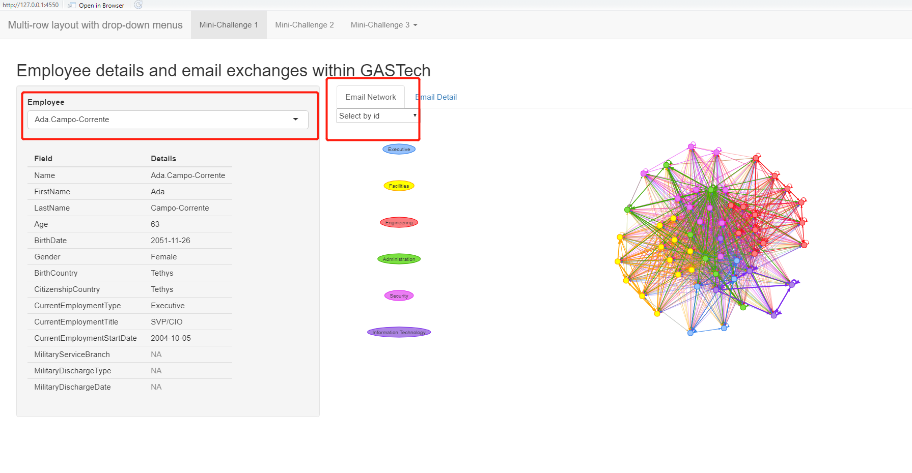
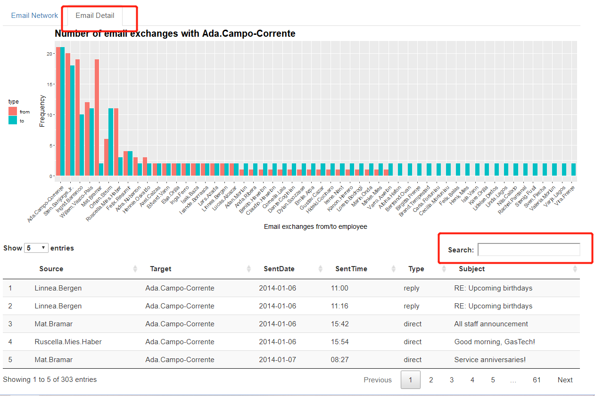
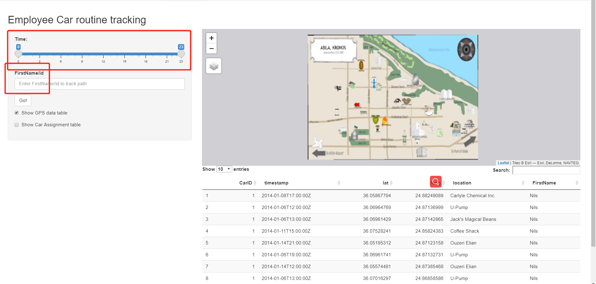
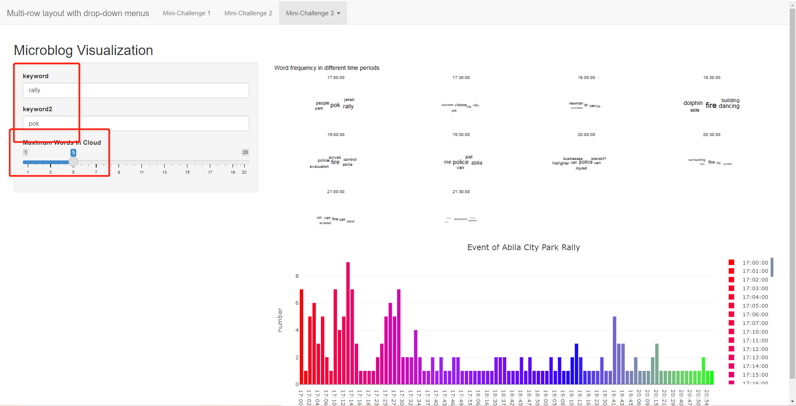
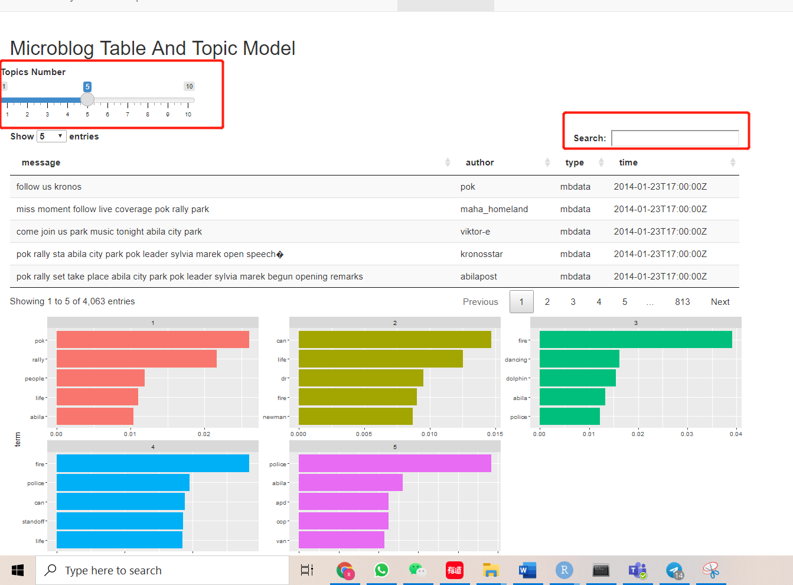

```{r setup, include=FALSE}
knitr::opts_chunk$set(echo = FALSE)
```

## Mini-Challenge-1  
In the side panel ,by selecting different employee names from the drop-down list, the employee profile and basic information will be displayed  below. The main panel shows the network of email exchanges for all except those that was sent to everyone, such as "morning briefing" from the administration department. Each node in the network contains the employee’s name and job title, and the color of the node represents The employee's department. By hovering over the node and edge, user can see the specific post of the employee and its neighbors in the network.


By selecting a user in the side bar, frequency graph shows the people who have large number of email exchanges with the employee. Orange indicates "from" those who send email to the employee, and blue indicates "to" those that the employee send email to. The bottom section shows the email "from" and "to" the employee selected. Filter the required information to get details of the emails by entering text in the search box. For example, enter the name of the employee who receives or sends emails, and the date and subject of the emails related to him can be displayed. User can search for keyword in the subject too. 


  


## Mini-Challenge-2  
In side panel,by changing the time range in slide bar and input specific car id, in the main panel ,the map will display  the correspondent  period and the car's driving track.And the table will show the location of the car corresponding to the selected car id at different times.  
  


## Mini-Challenge-3  
In the 'Key word' tab. By moving the slide bar in side panel,the word cloud graph in main panel will show different number of words in each word cloud graphs.By inputting different key word in text input box,the interactive bar chart in main panel will show micro blog message's number containing key words over time.  

  


In the 'Microblog Table' tab,we can change the topics number in topic modelling graph by moving 'Topic Number' slide bar to different value. 
Enter different text in the search box, you can filter out the messages that only contain specific keywords and the corresponding author and sending time.
  

