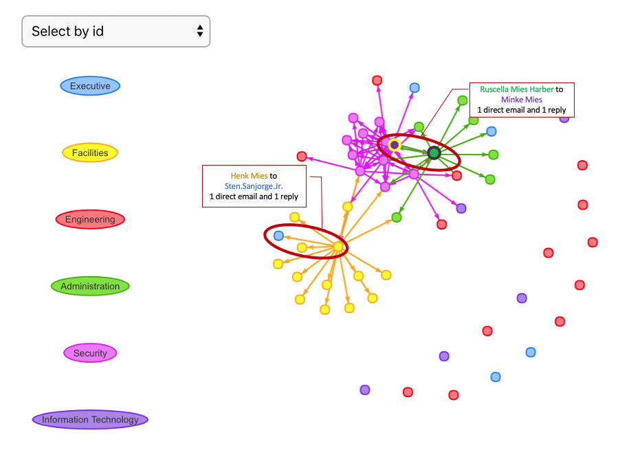
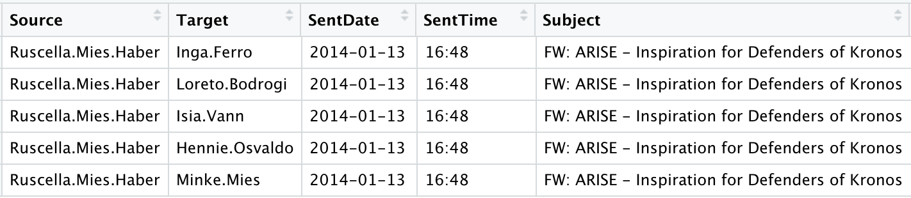
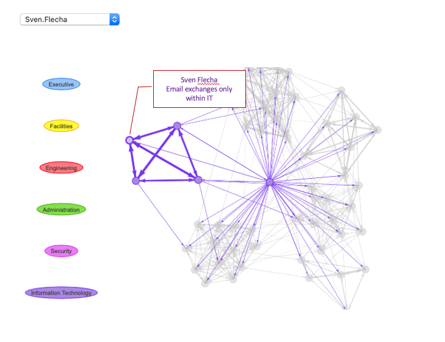
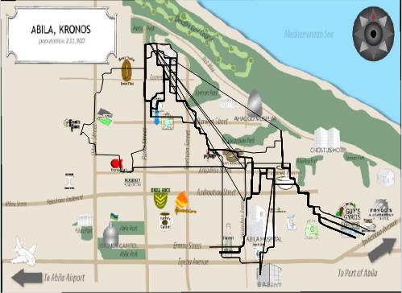
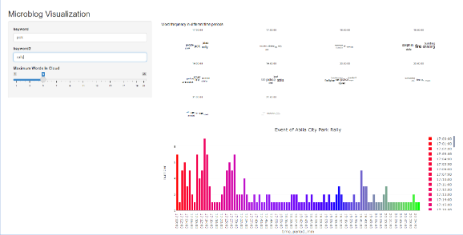
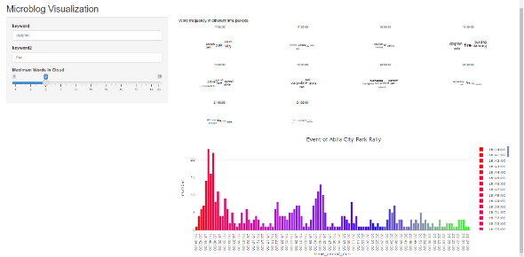
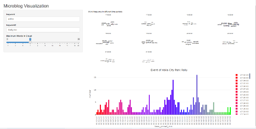
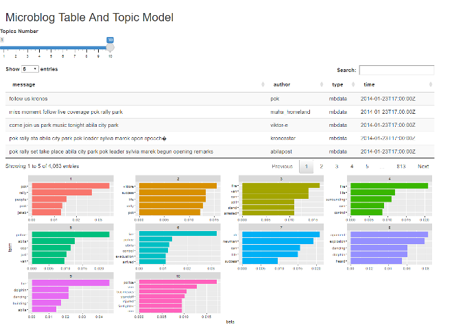
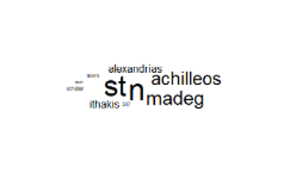

```{r setup, include=FALSE}
knitr::opts_chunk$set(echo=TRUE, message=FALSE, include=FALSE, warning=FALSE)
``` 

# Introduction 

The project is based on VAST project 2021 about a fictional incident in Kronos. The fictional company, GASTech, a Tethys-based oil company has been operating a site in Kronos and had a celebration of IPO in 2014 Jan. The company had developed a strong relationship and cooperation with Kronos government. However, it received  backlash for its being unsuccessful in demonstrating environmental stewardship. 

A significant opposing activist group, named Protectors of Kronos, was established in 1997. The grassroot organization aimed to protest against water pollution that was suspected to be highly related to GASTech site in Kronos. In the early years of POK led by the founders, the organization planned several peaceful events and the sharp turn happened when the successor, Elian Karel, took the lead of the organization. The protests and other planned events became more violent, especially after Tiseke River caught fire in 2005 and the leader, Karel's death in 2009. The objective of the organization extends to protest against the government's corruption. It was also classified as violent and terrorist group in the recent years by the local government.

The incident happened on Jan 23 2014 during the celebration event of GASTech's IPO. Several employees were reported missing. POK was suspected to be responsible for the kidnap event. 


# Objective

In this project, we take the stand of analysts and use visual analytic tools to gain deep understanding of the event, employee relationship, employee lifestyle and transaction behaviours, and microblog reaction during the event. There are 3 mini challenges released in the VAST challenge. The group has attempted all challenges but the paper will focus on analysing the employees in GASTech.

+ In mini challenge 1, employee email exchange data will be analyzed to find suspected employee;
+ Those suspected will be further analyzed for their lifestyle and potential anomalies from credit card transaction and car moving routes during the 2 weeks leading up to the incident.
+ Lastly, in mini challenge 3, microblog posts on Jan 23 from 3 social medias will be analyzed to detect key places and key event during the day. The key place and events will help to piece up the whole story of kidnap event. 

# Method and approach

All analysis were performed with R, including data pre processing and visualization. Key techniques used invlove network visualization, map visualisation, time series analysis of microblog message, and topic modeling. The data used in the analysis are:

+ Email headers of GASTech employee
+ Employee Records of GASTech employee
+ gps location of key locations and movements
+ car assignment details of GASTech employee
+ microblog text messages on the day of incident 

# Analysis

## MC1 - Inspect employee network to find suspected people

From the background information, we know that the founding leaders of POK are Henk Bodrogi, Jeroen Karel, Carmine Osvaldo and the current leaders are Elian Karel, Silvia Marek, Mandor Vann, Isia Vann, Lucio Jakab, Lorenzo Di Stefano, Valentine Mies, Yanick Cato and Joreto Katell. There are 7 employees with the same last name of middle name as the POK leaders. 5 of them are in securities and 1 of them is the truck driver. The combination enables them to conveniently bring in suspected people or bring out people sneakily. 



Most of them have emails sent to people outside of the department, especially Henk Mies, sent an email to the CEO, Sten Sanjorge Jr, named as “File attachment” on 17th Jan. There is no other email communication between them. Considering Henk Mies is a truck driver, there is unlikely that he has any crossover in work with the CEO. The email with no subject but only an attchment makes him suspicious.

By inspecting the email exchanges only among these people in Fig 1, it was also found out Ruscella Mies Haber, assistant to the engineering group manager, has sent emails to Minke Mies who is outside of the department about "FW: ARISE - Inspiration for Defenders of Kronos". The title contains defenders of kronos, which highly resembles Protectors of Kronos. Checking the people involved in the email, surprisingly most of them, Ruscella Mies Haber, Loreto Bodrogi, Isia Vann, Hennie Osvaldo, Minke Mies are having the same sir names as the POK leaders. There is potentially a small POK branch in GASTech. Rachel Pantanal and Inga Ferro, though not directly related to the POK leaders, potentially are in the group too. Especially considering that Rachel Pantanal was the one initiating the email. 

"Arise" in the email title, is also a magazine that APA sought to build brand through. There might be a link between the email and the Arise magazine. _"In recent years the APA has sought to build their brand through websites and the publication of a professional, high-quality magazine called "Arise"."_ (from International Times)

The table in Fig 2 shows a snippet of the email exchanges of “ARISE-inspiration for Defenders of Kronos”.



## MC2 - Inspect transaction and moving route of the suspected  

In the above section, a few GASTech employees are suspected for their relation with Protectors of Kronos, including Loreto Bodrogi(id:15), Isia Vann(id:16), Hennie Osvaldo(id:21) and Minke Mies(id:24). With their gps routes collected from the car assigned to them by the company, further analysis was conducted to find anomalies in their itinery before the incident happens. 
 
Suspicious route was detected by filtering the record during the early morning, 2am to 4am 
By filtering the records during the early morning (2am to 4am), car id 4, 10, 21, 32 and 35 which belong to Ingrid Barranco, Ada Campo-Torento, Stenig Fusil, Orhan Strum  and Edvard Vann arrived at **Car id: 16, Isia Vann's home** at 3:30am, Jan 11, 2014. Furthermore, it was detected that car id 21 and 24 that belong to Hennie Osvaldo and Minke Mies arrived at **Car id: 17, Sven Flecha's home** at 3:40am, Jan 9, 2014. 


It suggests that there were late night meetings at the time, just a few days before the incident. It was considered especially suspicious as there were no email exchange at all among Sven Flecha, Hennie Osvaldo and Minke Mies. Sven has only email exchanges with people within IT department while Osvaldo and Mies are from security department. Network relation showed in Fig 4.



Apart from the suspected people identified in previous section, it was also found that destinations of many workers are at **Car id: 2 Lars Azada's home**. By observing the time, these visits all happened at night on Jan 10 2014. There were more than 8 employees involved who are from multiple departments. (specifically, Nils Calixto, Felix Balas, Isak Baza, Lucas Alcazar, Axel Calzas and so on). It suggested that some for of party was held at Lars Azada's home, be it casual party or formal meeting. 



There are also general patterns discovered while completing mini challenge 2.

By changing hours and car id in the codes, we could find useful patterns:
1. Between 6am and 10am in all workdays, besides staying in homes and the company, employees usually appear in the cafeteria. It indicates that they often eat breakfast or buy the food on the way to the company.
2. For all the cars during the period between 4pm and 6pm in all working days, instead of stopping by the restaurants for dinner, employees usually drive back home directly. 
3. GAStech workers rarely have activities during the nights from Monday to Friday.

Finding 2 and 3 help us understand the daily routine and behaviour of GASTech employee. The rarity in social events and activities during nights from Monday to Friday makes occasional gathering at some employee's home especially suspicious, particularly those that happen at late nights.


## MC3 - Understanding the incident

In the mini-challenge 3, we used the microblogs and emergency calls to conduct text analysis and visualization to evaluate the changing levels of risk to the public throughout the evening, estimate the potential consequences of the situation and the number of people who could be affected. This allows deeper understanding of the incident and enables us to figure out the best locations to send the first respondors in order to decrease the risk and negative consequences. 
Text analysis and visualization of microblog messages on Jan 23, 2014 from 17:00 to 21:30, 3 main events happening at the night were discovered.

**POK rally in the Abila city park: **POK rally mainly occured from 17:00 to 17:30 early that night and from 18:40 to 18:50, from 19:40 to 19:50 afterwards (Fig 6). To a lesser degree between 17:30 and 18:30. In the shiny application,type keywords as ‘pok’ and ‘rally’ to filter out microblog messages only about pok rally in Abila city park.



**Dancing dolphin apartment fire:  ** The dancing dolphin apartment was deliberately set on fire, people were evacuated, and an explosion occurred (Fig 7). All the events in the dancing dolphin apartment have occurred between 18:30 and 20:00. In the shiny application, type keywords as ‘dolphin’ and ‘apartment’ to filter out microblog messages only about dancing dolphin apartment fire.



**Police and Firefighters Dispatch: ** The police were dispatched to arrest the suspect, and the firefighters were dispatched to extinguish the fire (Fig 8).  Police arrests the suspects and firefighters extinguishing fire are both occurred between 19:30 and 20:30. . In the shiny application, type keywords as ‘police’ and ‘firefighter’ to filter out microblog messages only about police and firefighter.



Using **Topic Modelling** to Distinguish Junk/Spam/Chatter from meaningful events, the LDA function was used, and the number of topic models is set to 10 in each topic in shiny application as initial value. From the visualization of the topic model, we found some topics are related to important events like the Abila city park rally(topic 1,2), dancing dolphin apartment fire(topic 3,4,5,6,8,9,10) and explosion and police, firefighters despatched(topic 6,8,10). After excluded these meaningful topics, others are junk or chatter. The results are shown in Fig 9.


By filtering messages in **Emergency call centre** to only include 'fire', we can get the location of the reported fire and call for rescue (Fig 10). Used these call’s locations to build word cloud to visualize the street names. And we found the dancing dolphin apartment where the fire broke out is located in **N. Achilleos Street** and **N. Madeg Street**. 




# Conclusion

The project has identified a few suspcious people.

+ Henk Mies who sent suspicious email to GASTech CEO, though there was unlikely any work related matters between them;
+ Ruscella Mies Haber, Loreto Bodrogi, Isia Vann, Hennie Osvaldo, Minke Mies, who are involved in the email "ARISE - Inspiration for Defenders of Kronos";
+ Sven Flecha, Hennie Osvaldo and Minke Mies who had a meeting at unusual timing of 3:40am though without any email exchanges at all;
+ Party at Lars Azada at night that involves more than 8 employees

We have also identified the main events at the night of incident, 

+ POK rally in the Abila City park
+ Dancing dolphin apartment fire
+ Police and firefighters dispatch

# Future study

The shiny app has demonstrated its functionality in gaining understanding of people and easy visualization of an incident. Its application could go beyond this single accident and be applied to understanding a network of any kind, such as social media network on people who involved in any type of incident. The microblog analysis and visualization will help users to gain insights on the key events.


---


