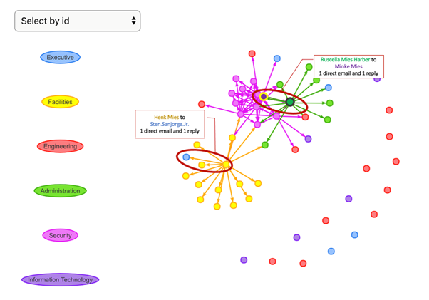
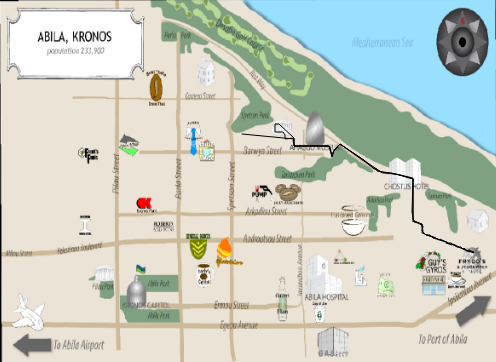
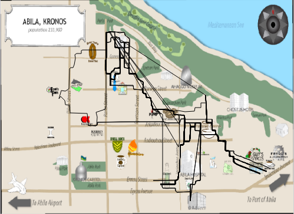

```{r, include=FALSE}
knitr::opts_chunk$set(echo = FALSE,
                      warning = FALSE,
                      tidy = FALSE,
                      message = FALSE,
                      fig.align = 'center',
                      out.width = "100%")
options(knitr.table.format = "html") 
```

# Introduction and objective

In the roughly twenty years that Tethys-based GAStech has been operating a natural gas production site in the island country of Kronos, it has produced remarkable profits and developed strong relationships with the government of Kronos.

During the celebration of the result of the initial public offering of their very successful company. several employees of GAStech go missing. An organization known as the Protectors of Kronos (POK) is suspected in the disappearances. We try to find and help those workers by understanding the complex relationships among them and peeking into those stuff's personal communication, social activities information.

With the given data, the project aims to visualize the relationship between each department, track cars' routine distribution and analyze information in social media during the incident.


```{r, include=FALSE}
knitr::write_bib(c('posterdown', 'rmarkdown','pagedown'), 'packages.bib')
```

# Methods
The project uses R for data processing and visualization, specifically through network analysis, text analysis and map visualization. 

## Vast Challenge 1

```{r warning=FALSE, include=FALSE} 
library("tidyverse") 
library('dplyr') 
library('lubridate') 
library('visNetwork') 
library('networkD3') 
library('ggplot2') 
employee_records <- read_csv("data/EmployeeRecords.csv") 
employee_records <- employee_records %>% 
  mutate(Name=paste(FirstName, LastName, sep=".")) %>% 
  transform(Name=sub(" ", ".", Name)) %>% 
  transform(BirthDate=parse_date_time(BirthDate,"%d/%m/%y"), 
            CitizenshipStartDate=parse_date_time(CitizenshipStartDate, "%d/%m/%y"), 
            PassportIssueDate=parse_date_time(PassportIssueDate, "%d/%m/%y"), 
            PassportExpirationDate=parse_date_time(PassportExpirationDate, 
                                                   "%d/%m/%y"), 
            CurrentEmploymentStartDate=parse_date_time(CurrentEmploymentStartDate, 
                                                       "%d/%m/%y"), 
            MilitaryDischargeDate=year(parse_date_time(MilitaryDischargeDate, 
                                                       "%d/%m/%y"))) %>% 
  mutate(Age=ifelse(year(BirthDate)>2014,  
                    2014-year(BirthDate)+100, 2014-year(BirthDate))) %>% 
  dplyr::select(Name, Age,everything()) %>% 
  arrange(Name) 
``` 

 

```{r warning=FALSE, include=FALSE} 
employee_email <- read.csv("data/email headers.csv", encoding="UTF-8") 
employee_email_agg <- employee_email %>% 
  transform(Subject=stringi::stri_enc_toascii(Subject)) %>% 
  separate_rows(To, sep=",") %>% 
  separate(From, c("From","FromEmail"), sep="@") %>% 
  separate(To, c("To","ToEmail"), sep="@") %>% 
  mutate(To=str_trim(To)) %>% 
  transform(Date=parse_date_time(Date, c("mdy_hm","mdy"))) %>% 
  transform(SentDate=date(Date), 
            SentTime=format(Date, format="%H:%M")) %>% 
  mutate(Type=ifelse(str_detect(Subject, "RE:")==TRUE, "reply","direct")) %>% 
  dplyr::select(From, To, SentDate, SentTime, Type, Subject) %>% 
  dplyr::rename(Source=From, Target=To) %>% 
  transform(Source=sub(" ", ".", Source), 
            Target=sub(" ", ".", Target)) 
``` 
 
```{r} 
employee_nodes <- employee_records %>% 
  dplyr::select(Name,Gender,Age,CurrentEmploymentType,CurrentEmploymentTitle, 
         CitizenshipCountry) %>% 
  dplyr::rename(label=Name, Department=CurrentEmploymentType, 
         Title=CurrentEmploymentTitle, Country=CitizenshipCountry) %>% 
  arrange(label) %>% 
  rowid_to_column("id") 
``` 

```{r} 
employee_nodes <- employee_nodes %>% 
  mutate(title=paste("<p>",label,Gender,Age,"</br>", 
                     "<br>",Department, Title,"</br></p>",sep=" ")) %>% 
  dplyr::rename(group=Department) 
``` 

```{r} 
name <- "Bodrogi|Karel|Osvaldo|Marek|Vann|Jakab|Stefano|Mies|Cato|Katell" 
employee_nodes_suspect <- employee_nodes %>% 
  filter(str_detect(label, name)) 
``` 

```{r warning=FALSE, include=FALSE} 
email_eachday <- employee_email_agg %>% 
  filter(Source!=Target) %>% 
  group_by(Source, SentDate, Type, Subject) %>% 
  dplyr::summarise(n=n()) %>% 
  filter(n==53) %>% 
  dplyr::select(Source, SentDate, Subject) %>% 
  arrange(Source,Subject) 
``` 

```{r warning=FALSE, include=FALSE} 
employee_email_agg2 <- email_eachday %>% 
  mutate(delete="yes") %>% #mark all emails in email_eachday as "yes" in delete 
  right_join(employee_email_agg, by=c("Source"="Source", 
                                      "Subject"="Subject", 
                                      "Type"="Type", 
                                      "SentDate"="SentDate")) %>% 
  filter(is.na(delete)) %>% #only keep those without a label in delete 
  filter(Source!=Target) %>% 
  dplyr::select(Source, Target, SentDate, SentTime, Subject, Type) 
``` 

```{r warning=FALSE, include=FALSE} 
employee_edges_suspect <- employee_email_agg2 %>% 
  right_join(employee_nodes_suspect%>%dplyr::select(id,label), 
            by=c("Source"="label"), suffix=c(".Source", ".Target")) %>% 
  left_join(employee_nodes%>%dplyr::select(id,label), 
            by=c("Target"="label"), suffix=c(".Source", ".Target")) %>% 
  dplyr::rename(from=id.Source, to=id.Target) %>% 
  group_by(from, to, Source, Target, Type) %>% 
  dplyr::summarise(Sum=n()) %>% 
  ungroup() %>% 
  group_by(from, to, Source, Target) %>% 
  mutate(value=sum(Sum)) %>% 
  mutate(Tooltip=paste(Sum, Type)) %>% 
  dplyr::select(-Sum, -Type) %>% 
  mutate(Tooltip=paste(Tooltip, collapse=", ")) %>% 
  mutate(title=paste("<p>from",Source,"to",Target, "</br>", 
                     Tooltip, "</br>")) %>% 
  ungroup() %>% 
  distinct(from, to, value, title) 
``` 

```{r eval=FALSE, include=FALSE} 
visNetwork(employee_nodes, employee_edges_suspect) %>% 
  visEdges(arrows = 'to', ) %>% 
  visOptions(highlightNearest = TRUE, nodesIdSelection = TRUE) %>% 
  visLegend() %>% 
  visIgraphLayout(layout="layout_nicely") 
``` 

{width=100%}


From the background information, we know that the founding leaders of POK are Henk Bodrogi, Jeroen Karel, Carmine Osvaldo and the current leaders are Elian Karel, Silvia Marek, Mandor Vann, Isia Vann, Lucio Jakab, Lorenzo Di Stefano, Valentine Mies, Yanick Cato and Joreto Katell. There are 7 employees with the same last name of middle name as the POK leaders. 5 of them are in securities and 1 of them is the truck driver. The combination enables them to conveniently bring in suspected people or bring out people sneakily.  

By inspecting their email exchanges among these people, it was found out Ruscella Mies Haber, assistant to the engineering group manager, has sent emails to Minke Mies who is outside of the department about "FW: ARISE - Inspiration for Defenders of Kronos". The title contains defenders of kronos, which highly resembles Protectors of Kronos. Checking the people involved in the email, surprisingly most of them, Ruscella Mies Haber, Loreto Bodrogi, Isia Vann, Hennie Osvaldo, Minke Mies are having the same sir names as the POK leaders. There is potentially a small POK branch in GASTech. Especially considering that Rachel Pantanal was the one initiating the email.  

"Arise" in the email title, is also a magazine that APA sought to build brand through. There might be a link between the email and the Arise magazine. _"In recent years the APA has sought to build their brand through websites and the publication of a professional, high-quality magazine called "Arise"."_ (from International Times) 


## Vast Challenge 2

In the above section, we find anomalies in Loreto Bodrogi, Isia Vann, Hennie Osvaldo and Minke Mies. Next we will visualize their cars' track to find invisible information.

By filtering the records during the early morning (2am to 4am), we find some anomalies during this special time. Ingrid Barranco, Ada Campo-Torento, Stenig Fusil, Orhan Strum  and Edvard Vann arrived at **Isia Vann's home** at 3:30am, Jan 11, 2014. Hennie Osvaldo and Minke Mies arrived at **Sven Flecha's home** at 3:40am, Jan 9, 2014.
 
```{r eval=FALSE}
library(DT)
library(raster)
library(tidyverse)
library(tmap)
library(clock)
library(rgdal)
library(lubridate)
library(sf)
library(shiny)
gps=read_csv("data/gps.csv")
names(gps)[names(gps) == 'Timestamp'] = 'timestamp'
gps_locationT=read_csv("data/gps_locationT.csv")
ap=raster("data/MC2-tourist.tif")
gps_t5=gps
gps_t5$timestamp=date_time_parse(gps_t5$timestamp,
                              zone = "",
                              format="%m/%d/%Y %H:%M:%S")
gps_t5$id=as_factor(gps$id)
gps_t5=gps_t5 %>%
  filter(hour(timestamp)>=2)%>%
  filter(hour(timestamp)<5)
gps_t5_sf=st_as_sf(gps_t5,
                coords = c("long","lat"),
                crs=4326)
gps_t5_path=gps_t5_sf %>%
  group_by(id) %>%
  dplyr::summarize(m=mean(timestamp),
            do_union=FALSE) %>%
              st_cast("LINESTRING")
gps_t5_path_selected=gps_t5_path %>%
  filter(id %in% c(4,10,35,32,16,21))
tmap_mode("view")
tm_shape(ap)+
  tm_rgb(ap,r=1,g=2,b=3,
         alpha=NA,
         saturation=1,
         interpolate=TRUE,
         max.value=255)+
  tm_shape(gps_t5_path_selected)+
  tm_lines()
```
{width=100%}
Apart from the suspected people identified in previous section, it was also found that destinations of many workers are at **Car id: 2 Lars Azada's home**. By observing the time, these visits all happened at night on Jan 10 2014. There were more than 8 employees involved who are from multiple departments.

```{r eval=FALSE}
gps_t5=gps
gps_t5$timestamp=date_time_parse(gps_t5$timestamp,
                              zone = "",
                              format="%m/%d/%Y %H:%M:%S")
gps_t5$id=as_factor(gps$id)
gps_t5=gps_t5 %>%
  filter(hour(timestamp)>=18)%>%
  filter(hour(timestamp)<24)
gps_t5_sf=st_as_sf(gps_t5,
                coords = c("long","lat"),
                crs=4326)
gps_t5_path=gps_t5_sf %>%
  group_by(id) %>%
  summarize(m=mean(timestamp),
            do_union=FALSE) %>%
              st_cast("LINESTRING")
gps_t5_path_selected=gps_t5_path %>%
  filter(id %in% c(19, 3, 11, 26, 5, 8, 1))
tmap_mode("view")
tm_shape(ap)+
  tm_rgb(ap,r=1,g=2,b=3,
         alpha=NA,
         saturation=1,
         interpolate=TRUE,
         max.value=255)+
  tm_shape(gps_t5_path_selected)+
  #tm_dots(size = 0.01)
  tm_lines()
```
{width=100%}
By changing hours and car id in the codes, we could find useful patterns:

1. Between 6am and 10am in all workdays. Besides staying in homes and the company, employees usually appear in the cafeteria. It indicates that they often eat breakfast or buy the food on the way to the company.

2. All the cars during the period between 4pm and 6pm in all working days. Instead of stopping by the restaurants for dinner, employees usually drive back home directly.

3. GAStech workers rarely have activities during the nights from Monday to Friday.

## Vast Challenge 3

In the Mini-challenge 3, a collection of microblogs and emergency calls from the days surrounding the disappearance is given. In order to visualize the occurrence and duration of important events, the time is divided into groups of every 30 min. The occurence of keywords are shown in the wordcloud below. The larger words represents larger impact. 
```{r }
packages = c('tm', 'SnowballC', 'wordcloud', 'stopwords',  
            'ggplot2','syuzhet','tidytext', 'igraph', 'visNetwork',  
             'tidygraph', 'ggraph', 'widyr', 'wordcloud','DT','ggwordcloud',  
            'textplot', 'tidyverse','lubridate','proustr','topicmodels',  
'topicmodels','textmineR','tm','LDAvis','servr','dplyr','stringi',    
'textclean','igraph','plotly')
for (p in packages){
  if(!require(p, character.only = T)){
    install.packages(p)
  }
  library(p,character.only = T)
}
```

```{r }
MC3_1<- read.csv("data/csv-1700-1830.csv")
MC3_2<- read.csv("data/csv-1831-2000.csv")
MC3_3<- read.csv("data/csv-2001-2131.csv")
MC3 <- rbind(MC3_1,MC3_2,MC3_3)
MC3$time<-ymd_hms(MC3$date.yyyyMMddHHmmss.)
MC3$message<-MC3$message%>%tolower()
MC3$author<-MC3$author%>%tolower()
MC3<-pr_stem_words(MC3,message, language = "english")
#Remove stop words
MC3$message<-MC3$message%>%removeWords(stopwords('english'))%>%  
# Replace all contraction word to normal  length  
replace_contraction()%>%  
# Trim white space in eachsentence sentence    
str_squish()%>%  
#Remove number
gsub(pattern ='[0-9]*',replacement = "",MC3$message)%>%
# Remove '#'  
gsub(pattern ='#[a-z]+',replacement = "",MC3$message)%>%  
# Remove '@' 
gsub(pattern ='@[a-z]+',replacement = "",MC3$message)%>%
#Remove 'rt'  
gsub(pattern ='rt',replacement = "",MC3$message)%>% 
# Remove punctuation and special symptom 
gsub(pattern ='[!-$.,?+-=%&]',replacement = "",MC3$message)%>%
replace_word_elongation()
MC3<-subset(MC3,select=c("message","author","type",'time','location'))
CALL<- MC3%>%filter(str_detect(MC3$type,'ccdata'))
MIBLOG<-MC3%>%filter(str_detect(MC3$type,'mbdata'))
MIBLOG$ID <- seq.int(nrow(MIBLOG))
MIBLOG$time_period = cut(MIBLOG$time, breaks="30 min")
MIBLOG$time_period<-MIBLOG$time_period %>% str_replace_all("2014-01-23","")  
MIBLOG$time_period_min = cut(MIBLOG$time, breaks="1 min")
MIBLOG$time_period_min<-MIBLOG$time_period_min %>% str_replace_all("2014-01-23","")
MIBLOG_TOPIC<-MIBLOG%>%
  group_by(time_period) %>% 
  unnest_tokens(word, message) %>%
  count(word, sort = TRUE)
```

```{r include=FALSE}
tf_idf <- MIBLOG_TOPIC%>%
  bind_tf_idf(word,time_period, n) %>%
  arrange(desc(tf_idf))

tf_idf %>%
  group_by(time_period) %>%
  slice_max(tf_idf, 
            n = 8) %>%
  ungroup() %>%
  mutate(word = reorder(word, 
                        tf_idf)) %>%
  ggplot(aes(tf_idf, 
             word, 
             fill = time_period)) +
  geom_col(show.legend = FALSE) +
  facet_wrap(~ time_period, 
             scales = "free",as.table=TRUE) +
  labs(x = "tf-idf", 
       y = NULL)
```  

```{r echo=FALSE}
set.seed(1234)
MIBLOG_TOPIC %>%
  group_by(time_period) %>% 
  slice_max(order_by = n, n = 8) %>% 
ggplot(aes(label = word,
           size = n)) +
  geom_text_wordcloud() +
  theme_minimal() +
  facet_wrap(~time_period)
```

The following important events that happened in Abila on 2014-1-23 night were inferred from the wordcloud. 

1.The organization of POK(Protectors of Kronos) held a rally in Abila city park from 17:00 on and 'Sylvia Marek' is their leader.   
2.Dancing dolphin apartment got fired at 18:30. After 21:30, there was an explosion in the building.  
3.After 20:00:00, the firefighters arrived at the apartment and started to put out the fire. The police caught the suspect in a van after 21:00.  
4.The police were dispatched at 18:30 and caught the suspect in a van after 21:00.  
Apart from the time, the impact of events over time, which indicates the level of risk is also important to understand through visualization. The keywords of the  event is used to filter and extract the corresponding messages They are then grouped by every 30 minutes for the frequency of such keywords.
```{r  eval=TRUE} 
pal <- c("red","purple","blue","green")
MIBLOG_rally<-MIBLOG%>%filter(str_detect(message,'pok')|   str_detect(message,'rally')|str_detect(message,'abila')|    
  str_detect(message,'park'))%>%
group_by(time_period_min) %>%
summarise(number = n()) 

plot_ly(data = MIBLOG_rally,
x = ~time_period_min,
y = ~number,
color = ~time_period_min,
colors = pal)%>%
layout(title = 'Event of Abila City Park Rally')
```
According to the above picture, POK rally mainly occurs from 17:00 to 17:30 early that night and from 18:40 to 18:50 ,from 19:40 to 19:50 afterwards.To a lesser degree between 17:30 and 18:30.
```{r eval=TRUE} 
pal <- c("red","purple","blue","green")
MIBLOG_apartment<-MIBLOG%>%filter(str_detect(message,'fire')|    str_detect(message,'apartment')|str_detect(message,'dophin')|                            str_detect(message,'evacuation')|str_detect(message,'explosion')|  
str_detect(message,'dancing'))%>%
group_by(time_period_min) %>%
summarise(number = n()) 

plot_ly(data = MIBLOG_apartment,
x = ~time_period_min,
y = ~number,
color = ~time_period_min,
colors = pal)%>%
layout(title = 'Event of dophin apartment fire')

```
According to the above picture, apartment fires and evacuation occurred between 18:30 and 20:00.
```{r eval=TRUE} 
pal <- c("red","purple","blue","green")
MIBLOG_apartment<-MIBLOG%>%filter(str_detect(message,'police')|                        str_detect(message,'van')|str_detect(message,'arrested')|  
str_detect(message,'firefighter'))%>%
group_by(time_period_min) %>%
summarise(number = n()) 

plot_ly(data = MIBLOG_apartment,
x = ~time_period_min,
y = ~number,
color = ~time_period_min,
colors = pal)%>%
layout(title = 'Police And Firefighters Action')

```
According to the above picture, police arrests of suspects and firefighters extinguishing fire mainly occurred between 19:30 and 20:30.


